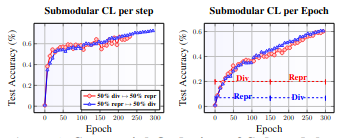
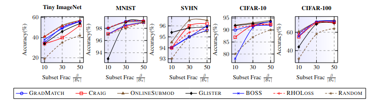

### 🧩 Problem Statement

Traditional **curriculum learning** assumes a fixed notion of “easy-to-hard” sample progression, yet defining *difficulty* is often arbitrary and domain-dependent.  
Meanwhile, **adaptive subset selection** methods—though powerful—can be computationally heavy.

We ask:  
> Can we design a *principled*, *efficient*, and *adaptive* curriculum that learns which samples to train on—guided directly by validation performance?

Formally, given a dataset $D = \{(x_i, y_i)\}_{i=1}^N$, the goal is to select a subset  
$S_t \subseteq D$ at training step $t$ that maximizes the validation utility $U(S_t)$ while maintaining efficiency.  
Curriculum learning can be posed as the optimization:

$$
\max_{S_t \subseteq D} \; f(S_t) = \mathbb{E}_{(x,y)\sim S_t} [ \ell(x, y; \theta_t) ],
$$
where $f(\cdot)$ is a **submodular function** encoding representativeness and diversity.

---

### ⚙️ Methodology in a Nutshell: ONLINESUBMOD

We propose **ONLINESUBMOD**, a *bandit-guided submodular curriculum* framework.  
At each iteration, ONLINESUBMOD treats a pool of submodular functions
$\{ f_1, f_2, \dots, f_K \}$
as *arms* in a **multi-armed bandit (MAB)** setup.  
Each $f_k$ captures a different data-selection prior — e.g., **diversity**, **representativeness**, or **uncertainty**.

At step $t$:
1. A submodular function $f_{a_t}$ is selected.
2. A subset $S_t = \arg\max_{S \subseteq D_t, |S| \leq b} f_{a_t}(S)$ is chosen.
3. The model is trained on $S_t$, and a **validation reward**
   $r_t = \Delta \ell_{\text{val}} = \ell_{\text{val}}(\theta_{t-1}) - \ell_{\text{val}}(\theta_t)$
   is observed.

---

#### 🧠 Bandit Objective

The bandit aims to maximize the cumulative expected validation reward:

$$
\max_{\pi} \; \mathbb{E} \left[ \sum_{t=1}^{T} r_t \right],
$$
where $\pi$ is the arm-selection policy.  
Each arm corresponds to a submodular function $f_k$, and the expected reward is:

$$
\mathbb{E}[r_t | a_t = k] = g(f_k),
$$
linking **subset quality** directly to validation improvement.

---

#### 🧮 Submodular Maximization Step

For each selected arm $k$, ONLINESUBMOD solves a **budget-constrained submodular maximization**:

$$
S_t = \arg\max_{S \subseteq D_t, |S| \leq b} f_k(S),
$$
where $f_k(S)$ satisfies diminishing returns:

$$
f_k(A \cup \{x\}) - f_k(A) \ge f_k(B \cup \{x\}) - f_k(B), \quad A \subseteq B.
$$

A greedy selection provides a $(1 - 1/e)$-approximation to the optimal subset.

---

#### ⚖️ No-Regret Guarantee

The policy uses an **EXP3-based no-regret bandit update** to adaptively weigh the arms:

$$
w_{k,t+1} = w_{k,t} \exp(\eta \hat{r}_{k,t}),
$$
where $\hat{r}_{k,t} = \frac{r_t \mathbb{I}[a_t = k]}{p_{k,t}}$  
and $p_{k,t} = \frac{w_{k,t}}{\sum_j w_{j,t}}$.

Theoretical guarantee:
$$
\text{Regret}(T) = \mathcal{O}(\sqrt{T K \log K}),
$$
ensuring convergence to the best fixed submodular function in hindsight.

---

#### 🧩 Summary of Key Ideas

- **Bandit Formulation:** Each submodular function acts as an arm; arm rewards come from validation improvement.
- **No-Regret Policy:** Online EXP3 updates ensure the learner focuses on consistently beneficial submodular functions.
- **Utility-Driven Curriculum:** The model adaptively prioritizes data contributing most to validation performance.
- **Efficiency:** Submodular maximization introduces <1 ms overhead compared to gradient updates.

 <em>Figure: Bandit-guided selection of submodular functions over training.</em>

---

### 📊 Results Overview

#### 1. **LLM Finetuning (LLaMA-2-7B, Mistral-7B on LESS → MMLU, TYDIQA)**
ONLINESUBMOD achieves the best accuracy across most domains while maintaining low perplexity throughout training.

| Method | Avg. | Soc. | Pol. | Hist. | ML | Eth. | Bio | Chem | TydiQA |
|:-------|:-----:|:----:|:----:|:----:|:--:|:----:|:----:|:----:|:-------:|
| GradNorm | 46.4 | 61.0 | 62.5 | 52.1 | 40.5 | 40.2 | 46.7 | 42.9 | 54.6 |
| GREATS | 47.8 | 63.2 | 66.2 | 48.3 | 42.6 | 41.1 | 48.9 | 43.1 | 55.7 |
| **ONLINESUBMOD** | **49.6** | **65.3** | **67.4** | **52.1** | **45.2** | **42.7** | **50.9** | **45.1** | **55.9** |

*ONLINESUBMOD yields ~3% absolute gain on average, with faster convergence.*

#### 2. **Vision Tasks (CIFAR-10/100, TinyImageNet, MNIST, SVHN)**

| Dataset | 10% Budget | 30% Budget | 50% Budget |
|:---------|:-----------|:-----------|:-----------|
| **CIFAR-100** | 0.736 / 9.2× | 0.754 / 3.3× | 0.758 / 1.9× |
| **TinyImageNet** | 0.553 / 8.4× | 0.607 / 3.1× | 0.626 / 2.6× |
| **CIFAR-10** | 0.924 / 5.4× | 0.937 / 2.0× | 0.941 / 2.0× |

(Values: *accuracy / relative speedup*)  
Even with only 30% of the training data, ONLINESUBMOD matches or exceeds full-data accuracy.

 <em>Figure: ONLINESUBMOD achieves top-1 accuracy and near-optimal speedup across datasets.</em>

---

### 🧠 Why It Works

- The **validation-aware reward** ties the learning signal directly to generalization.
- **Bandit-driven exploration** balances diversity and representativeness dynamically.
- **Submodularity** ensures principled and efficient subset selection.
- **No-regret updates** theoretically guarantee long-term optimality.

Formally, the expected cumulative reward satisfies:

$$
\sum_{t=1}^{T} r_t \ge \sum_{t=1}^{T} r_t^* - \mathcal{O}(\sqrt{T K \log K}),
$$
ensuring the learner asymptotically approaches the best submodular policy.

---

### 🚀 Summary

ONLINESUBMOD bridges *curriculum learning* and *adaptive data selection* under a unified theoretical framework.  
It efficiently learns *what to learn next*—offering a robust, scalable path for efficient model training, especially in large-scale **vision and language** settings.

> 📂 **Code:** [https://github.com/efficiency-learning/banditsubmod](https://github.com/efficiency-learning/banditsubmod)

---

*© 2025 Efficiency Learning Group, IIT Bombay. All rights reserved.*
